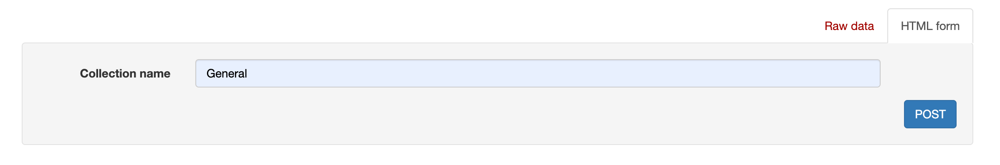
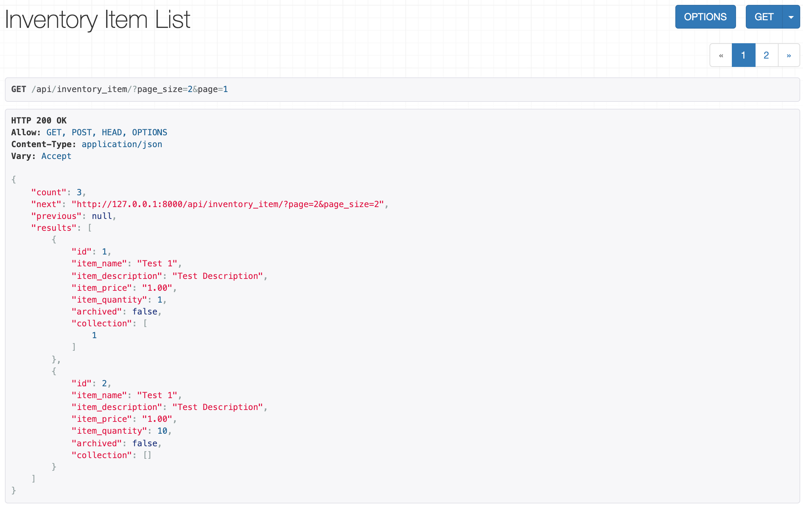
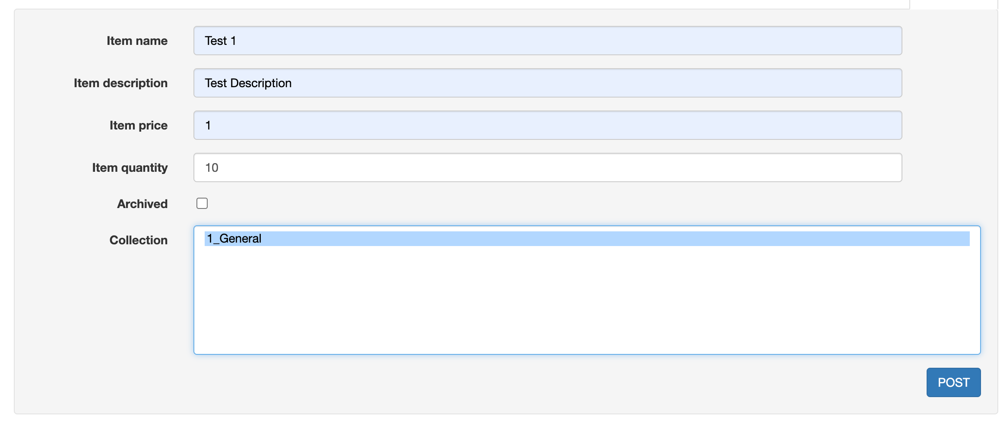
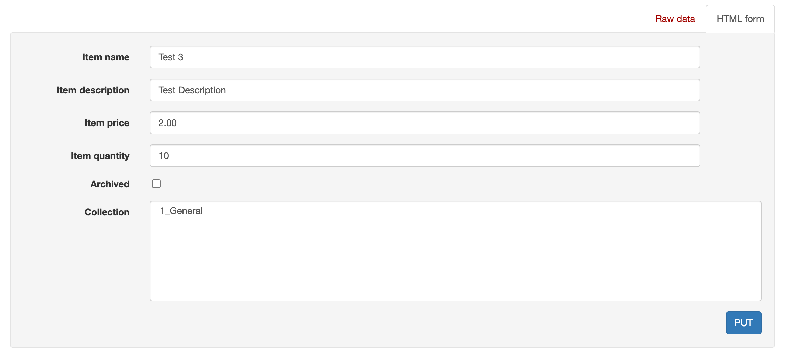
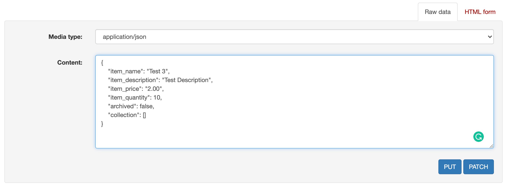
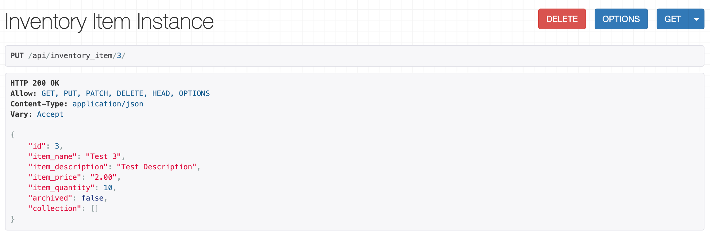

# Shopify Inventory CRUD API

[](https://github.com/RichardLitt/standard-readme)


## Table of Contents

- [About](#about)
- [Setup](#setup)
- [Endpoints](#endpoints)


## **V IMPORTANT: ** Add .env file to the application root folder. See setup for details.
## About

- This application depends upon a knowledge of [Python 3](https://docs.python.org/3/), [Django](https://www.djangoproject.com/) and [DRF](https://www.django-rest-framework.org/).
- The application implements the basic CRUD functionality for inventory items as required by the [Shopify Internship Challenge](https://docs.google.com/document/d/1z9LZ_kZBUbg-O2MhZVVSqTmvDko5IJWHtuFmIu_Xg1A/edit). No authentication or frontend implemented as not required.
- Additional Feature: Ability to assign/remove inventory items to a named group/collection.
- The testing is implemented for the main application functionalities.
- The app utilizes the default Django database local spin off, sqlite3. In production, it would be configured to a database instance in cloud. Any noSQL or SQL database can be used.

## Setup
**V IMPORTANT: ** Add .env file in the application root folder. In the folder you will also find the file "manage.py".
The .env file has been removed to not expose sensitive information.
You can download it here: [env.](https://drive.google.com/file/d/12dDvlXg-_KAvuzTm_fEd7hLbzxyaV24v/view?usp=sharing)
If the file is downloaded with the name, "env", ensure to rename it to ".env".

In a production setting, this would have been stored using the something like AWS key Management Services.
Please follow the instructions below after adding the .env file to run the application.

If you do not have pipenv installed. Please see the [link](https://pipenv.pypa.io/en/latest/install/) to install it.
You can use the following command to ensure pipenv is installed.
```
pipenv --version
```
Clone the git repository from GitHub by running the following command in the terminal.
```
git clone https://github.com/mustufajan/shopify_crud_app.git
```
Open a terminal in the root directory of the application. Use the following commands to set up the virtual environment and start the application server.
```
pipenv install
pipenv run server
```
This will:
- Install the required OS libraries
- Install the python packages
- Start the application server

## Endpoints
The documentation covers the usage of the application through the Django REST Framework API user interface. You can alternatively use Postman as well.

We will first create an inventory collection that we can assign inventory items to.

### Create an inventory collection
Head over to http://localhost:8000/api/inventory_collection/ using a browser.
Fill in the POST form and press the POST button to create an inventory item.
```
POST http://localhost:8000/api/inventory_collection/
```


### List all inventory items
Head over to http://localhost:8000/api/inventory_item/ using a browser.
This endpoint's response is paginated. You can use query parameters like page_size and "page" to navigate.
- Parameters
    - page_size
    - page

```
GET http://localhost:8000/api/inventory_item/?page_size=2&page=1
```


### Create an inventory item
Fill in the POST form and press the POST button to create an inventory item.
```
POST http://localhost:8000/api/inventory_item/
```


### Edit an inventory item
Fill in the HTML form or manual JSON and press the PUT/PATCH button to edit an inventory item. If using the manual JSON format, note that the collection field is a list of ids of the collections the inventory item is assigned to.
```
PUT/PATCH http://localhost:8000/api/inventory_item/{id_of_the_inventory_item}/
e.x. http://localhost:8000/api/inventory_item/3/
```




### Delete an inventory item
Press the DELETE button to delete an inventory item. This API call does not delete the items in the database. It sets the 'archived' field to True. This ensures that the inventory items are not accessible through GET requests but are still stored in the database.
Future functionalities can be built around this retroactively to support undeletion as well.
```
DELETE http://localhost:8000/api/inventory_item/{id_of_the_inventory_item}/
e.x. http://localhost:8000/api/inventory_item/3/
```

